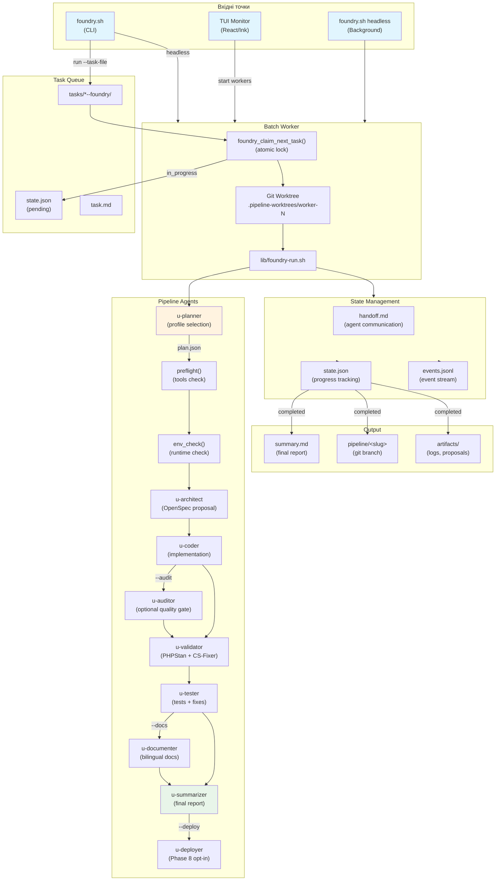

# Agentic Development Audit Report

**Дата:** 2026-03-26  
**Аналіз:** Структура, дублікати, залишки старого коду, пропозиції рефакторингу  
**Оновлено:** 2026-03-26 (після рефакторингу)

---

## ✅ Виконані зміни (Refactoring Completed)

| Зміна | Статус | Результат |
|-------|--------|-----------|
| Видалити `ultraworks-monitor.sh` | ✅ Done | -1468 рядків Bash |
| `ultraworks.sh` → thin wrapper навколо Ink TUI | ✅ Done | -90 рядків |
| Видалити `LEGACY_*` та `maybe_migrate_legacy_foundry_tasks()` | ✅ Done | -85 рядків |
| Замінити Python slugify на Bash | ✅ Done | Python видалено з slugify |
| Видалити виклики `maybe_migrate_legacy_foundry_tasks` | ✅ Done | 9 файлів очищено |

---

## 📁 Таблиця файлів з кодом (After Refactoring)

### Entrypoints (Public API)

| Файл | Роль | Хто викликає | Статус |
|------|------|-------------|--------|
| `foundry.sh` | Головний CLI для Foundry workflow | Користувач, CI, make | ✅ Активний |
| `ultraworks.sh` | Thin wrapper → Ink TUI | Користувач | ✅ Активний |

### Core Library (lib/)

| Файл | Роль | Рядки | Статус |
|------|------|-------|--------|
| `foundry-common.sh` | Спільні функції: state management, task lifecycle, git worktrees, **Bash slugify** | ~1410 | ✅ Core |
| `foundry-run.sh` | Sequential pipeline executor | ~1400 | ✅ Core |
| `foundry-batch.sh` | Parallel worker manager | 297 | ✅ Core |
| `foundry-preflight.sh` | Pre-flight checks | ~200 | ✅ Active |
| `env-check.sh` | Environment validation | 540 | ✅ Active |
| `foundry-cleanup.sh` | Cleanup old tasks | 56 | ✅ Active |
| `foundry-stats.sh` | Task statistics | 70 | ✅ Active |
| `foundry-retry.sh` | Retry failed tasks | 78 | ✅ Active |
| `foundry-setup.sh` | Directory init | ~50 | ✅ Active |
| `foundry-e2e.sh` | E2E → task creation | ~150 | ✅ Active |
| `foundry-telegram.sh` | Telegram HITL bot | ~100 | ✅ Active |
| `ultraworks-postmortem-summary.sh` | Summary generation | ~150 | ✅ Active |
| `normalize-summary.py` | Summary processing (Python) | ~307 | ⚠️ Pending TS migration |
| `cost-tracker.sh` | Token cost tracking | ~100 | ✅ Active |

### TUI Monitor (monitor/)

| Файл | Роль | Технологія | Статус |
|------|------|------------|--------|
| `src/index.tsx` | Entry point | React/Ink | ✅ Active |
| `src/components/App.tsx` | Main TUI (Foundry + Ultraworks) | React/Ink | ✅ Active |
| `src/lib/tasks.ts` | Task state helpers | TypeScript | ✅ Active |
| `src/lib/actions.ts` | Foundry/Ultraworks actions | TypeScript | ✅ Active |
| `src/lib/format.ts` | Formatting helpers | TypeScript | ✅ Active |

---

## 🔷 Mermaid Діаграма: Foundry Pipeline Flow



---

## 🔍 Вирішені проблеми

### ✅ 1. Legacy Migration Code — ВИДАЛЕНО

**Було:**
```bash
LEGACY_FOUNDRY_TASK_ROOT="${FOUNDRY_HOME}/tasks"
LEGACY_FOUNDRY_QUEUE_ROOT="${FOUNDRY_HOME}/foundry-tasks"
maybe_migrate_legacy_foundry_tasks() { ... }  # 85 рядків
```

**Стало:** Код видалено повністю з `foundry-common.sh` та 9 скриптів, що його викликали.

### ✅ 2. Ultraworks Bash TUI — ВИДАЛЕНО

**Було:** `ultraworks-monitor.sh` (~1468 рядків Bash TUI коду)

**Стало:** `ultraworks.sh` — thin wrapper (~110 рядків), що делегує до Ink TUI.

### ✅ 3. Python Slugify — ЗАМІНЕНО

**Було:**
```bash
pipeline_slugify() {
  python3 - "$text" <<'PYEOF'
  import re
  ...
  PYEOF
}
```

**Стало:**
```bash
pipeline_slugify() {
  local text="${1:-unknown}"
  local title=""
  ...
  slug=$(echo "$title" | tr '[:upper:]' '[:lower:]' | tr -cs 'a-z0-9' '-' | sed 's/^-//;s/-$//')
  echo "${slug:0:60}"
}
```

---

## ⚡ Залишкові пропозиції

### 1. **normalize-summary.py → TypeScript**

| Поточний | Пропозиція |
|----------|-----------|
| `lib/normalize-summary.py` (307 рядків) | `monitor/src/lib/normalize-summary.ts` |

**Вигода:** Повна відмова від Python в agentic-development.

### 2. **State Management: TypeScript Port**

`foundry-common.sh` має багато inline Python для JSON parsing:

```bash
# Приклад з foundry_process_status()
python3 - "$REPO_ROOT" <<'PYEOF'
import subprocess, sys, os, json
...
PYEOF
```

**Рекомендація:** Перенести в TypeScript модуль, викликати через `npx tsx`.

### 3. **Telegram QA Bot — залишити (підтверджено)**

Telegram Q&A залишається як опціональний функціонал.

---

## 📊 Метрики коду (After Refactoring)

| Категорія | Було | Стало | Δ |
|-----------|------|-------|---|
| Bash scripts (lib/) | ~3500 | ~2900 | -600 |
| Python helper | ~350 | ~307 | -43 |
| TypeScript (monitor/) | ~500 | ~500 | 0 |
| **Всього** | ~4350 | ~3700 | **-650** |

---

## 🎯 Висновок

**Рефакторинг завершено:**
- ✅ Видалено ~650 рядків коду
- ✅ `ultraworks-monitor.sh` → Ink TUI
- ✅ Legacy migration code видалено
- ✅ Python slugify → Bash
- ✅ Усі виклики `maybe_migrate_legacy_foundry_tasks` видалені

**Залишилось (P3):**
- `normalize-summary.py` → TypeScript
- Inline Python в `foundry-common.sh` → TypeScript modules

**Архітектура тепер:**
- Один TUI (React/Ink) для Foundry та Ultraworks
- Bash для orchestration, TypeScript для UI
- Мінімум Python (тільки normalize-summary.py)
