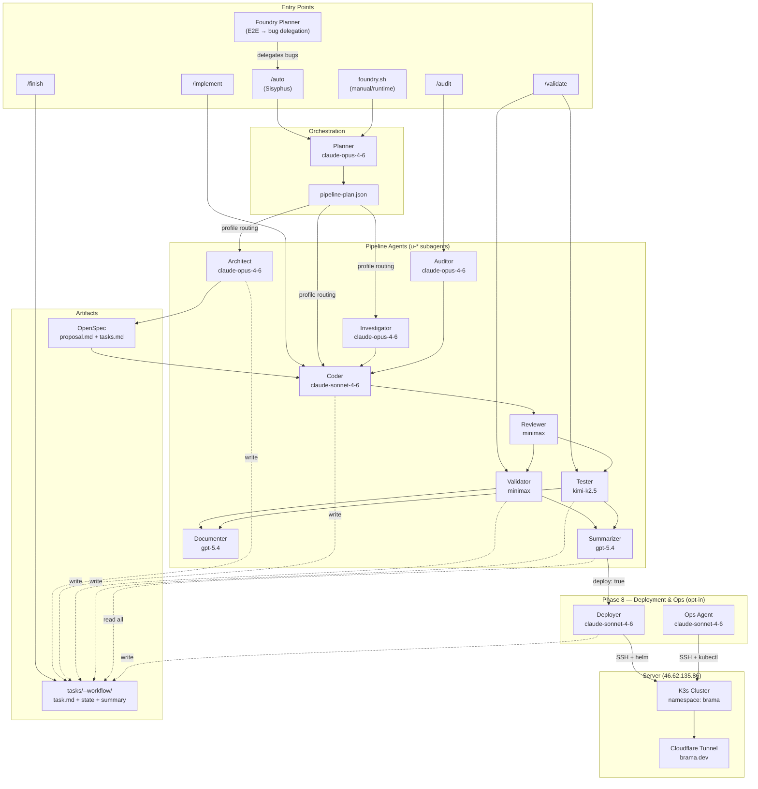
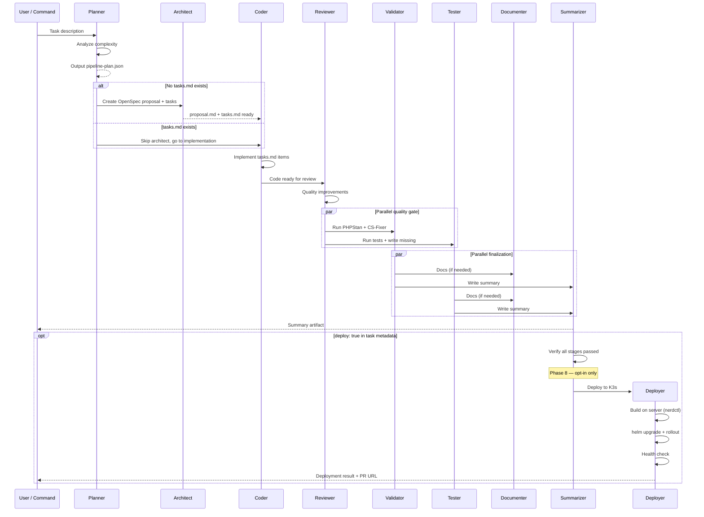
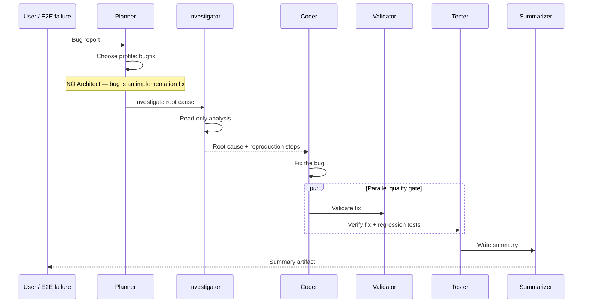
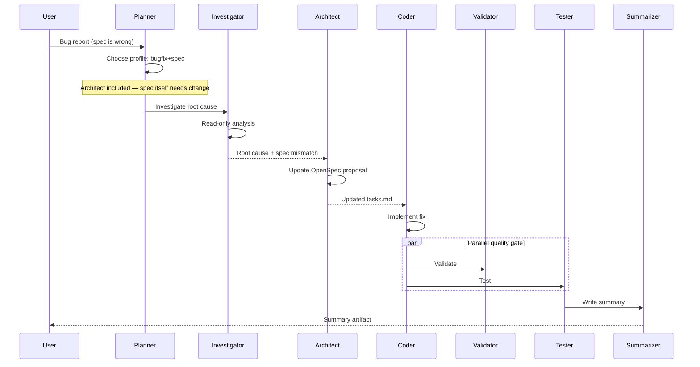
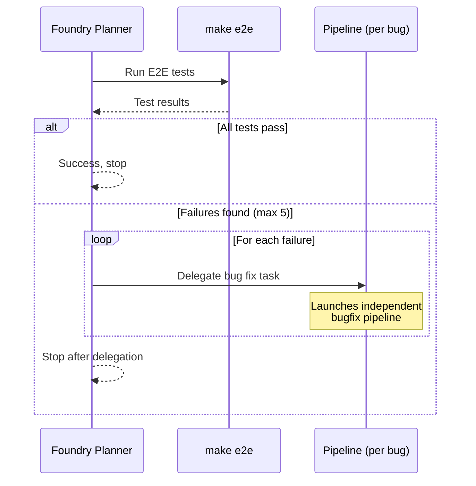
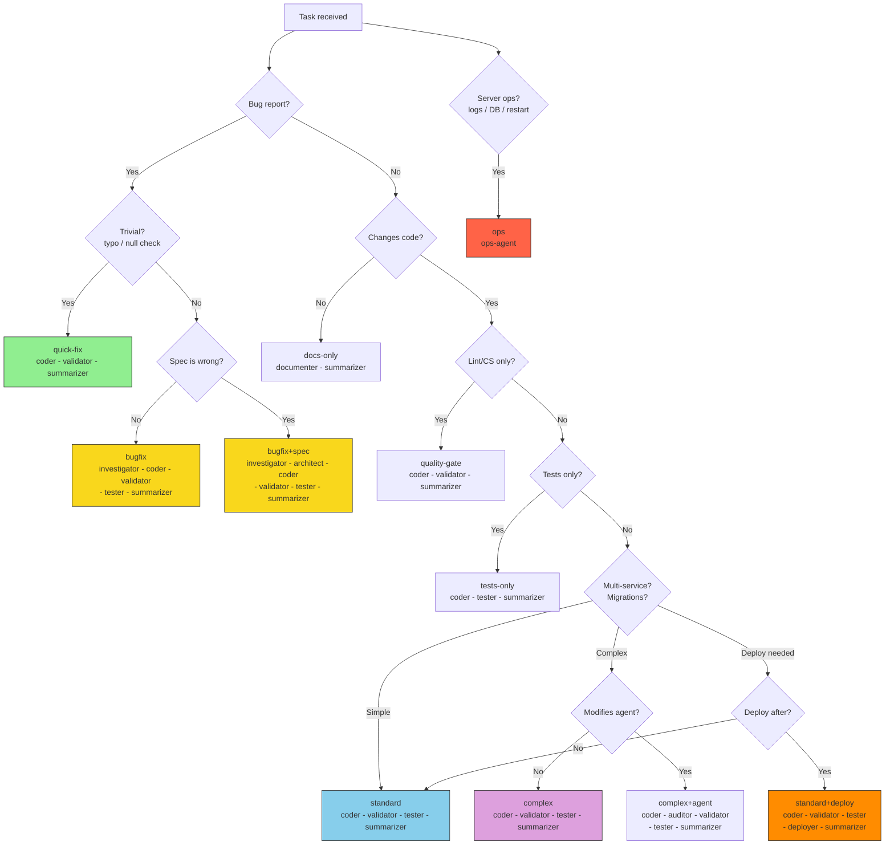

# Pipeline Workflow — Agent Orchestration

Diagrams below describe the current workflow, public entrypoints, and task-state storage.

## Runtime Model

Public entrypoints:

- `./agentic-development/foundry.sh`
- `./agentic-development/ultraworks.sh`

Task-local state:

```text
tasks/<slug>--foundry/
tasks/<slug>--ultraworks/
```

Each task directory is the durable source of truth for:

- `task.md`
- `handoff.md`
- `state.json`
- `events.jsonl`
- `summary.md`
- `meta.json`

Wrapper-level logs live in:

```text
agentic-development/runtime/logs/
```

---

## 1. Architecture Overview



---

## 2. Feature Development Flow (standard / complex)



---

## 3. Bug Fix Flow (bugfix profile)



---

## 4. Bug Fix + Spec Change Flow (bugfix+spec profile)



---

## 5. Foundry Planner Flow (E2E to Bug Delegation)

Daily entrypoint for this flow:

```bash
./agentic-development/foundry.sh autotest 3 --smoke --start
./agentic-development/foundry.sh autotest -n 10 --start
./agentic-development/foundry.sh autotest 5 --from-report .opencode/pipeline/reports/e2e-autofix-20260324_154309.json
```



---

## 6. Profile Selection Matrix



---

## 7. Inter-Agent Communication

All agents communicate via the task directory, with **`handoff.md`** as the human-readable bus:

| Agent | Writes to handoff | Reads handoff |
|-------|------------------|---------------|
| Planner | Initializes: task + profile | For resume |
| Architect | Spec decisions | -- |
| Investigator | Root cause + findings | -- |
| Coder | Files changed, migrations, deviations | -- |
| Validator | PHPStan/CS results per app | -- |
| Tester | Test results, new tests | -- |
| Auditor | Verdict + findings | -- |
| Documenter | Docs created/updated | -- |
| **Summarizer** | **Final summary** | **Reads ALL** |
| **Deployer** | **Deployment result, PR URL, health check** | **Reads ALL (verify stages passed)** |
| **Ops Agent** | **Server state, logs, DB query results** | **On-demand (no pipeline context)** |

> **CONTEXT-CONTRACT**: Agents receive context via prompt `CONTEXT`, **not** by reading handoff.md directly (exception: Planner, Summarizer, Deployer).

> **Deployer** is Phase 8 — opt-in only. Runs after Summarizer when `deploy: true` is in task metadata and all previous stages passed. See [deployer-agent.md](../../pipeline/en/deployer-agent.md).

> **Ops Agent** is standalone — not part of the pipeline. Use the `ops` profile to query live server state: logs, DB, pod status, image builds. See [deploy-to-kube.md](../../deploy-to-kube.md).
